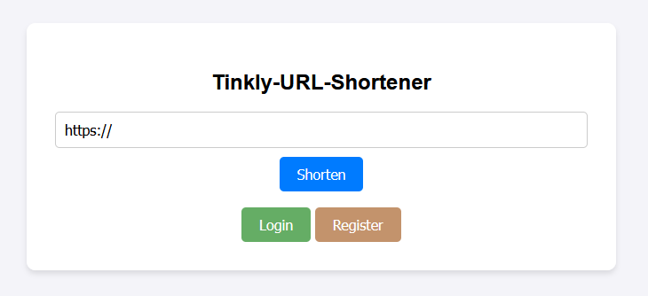
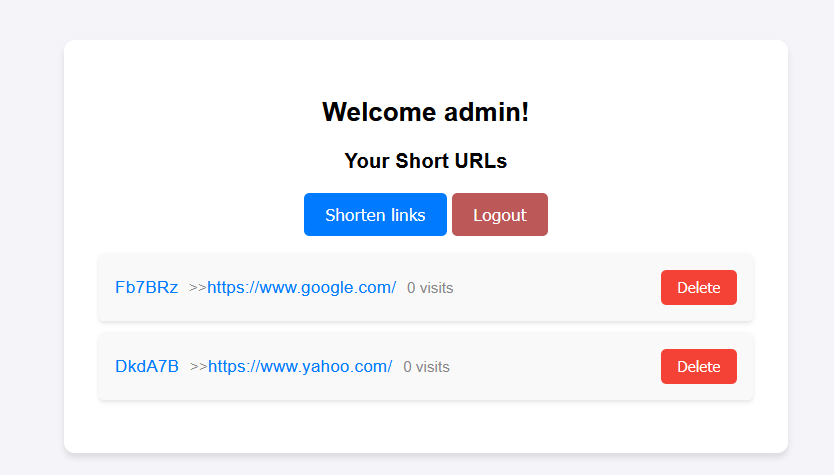
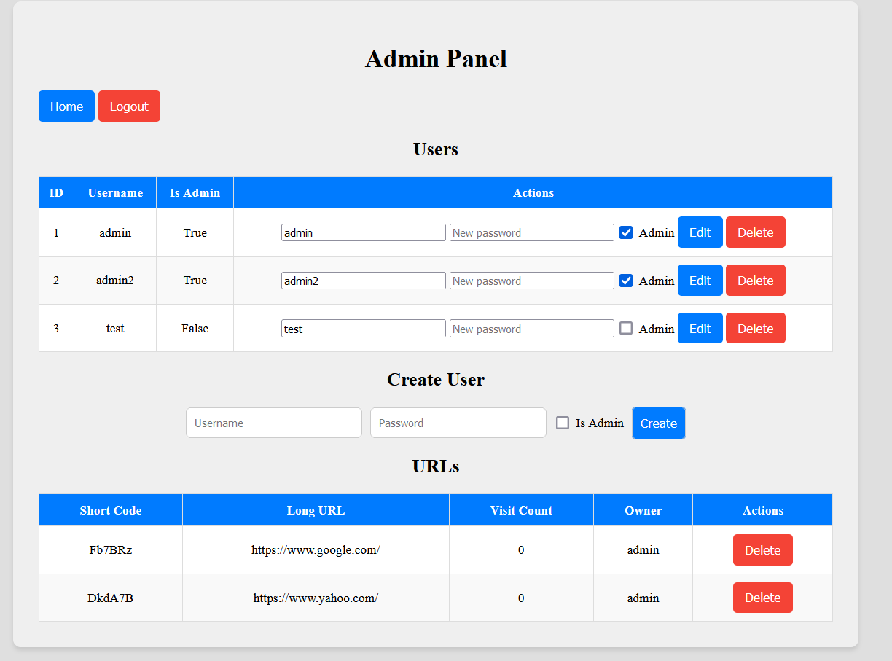

# Tinkly - URL Shortener
[](https://github.com/MurtadaAhmed/Tinkly-URL-Shortener/actions/workflows/pipeline.yml)

**Tinkly** is a simple and fast URL shortening service built using **FastAPI** and **SQLAlchemy** for database interaction. This project allows users to shorten URLs, redirect them, and track the number of visits for each short URL.


---

## Features

- **URL Shortening**: Generate short links from long URLs.
- **User Accounts**: Ability to register an account to track the generated short URLs through the dashboard.
- **Automatic Redirection**: Shortened URLs redirect to the original long URL.
- **Visit Tracking**: Track the number of visits for each short URL.
- **Statistics**: View the visit count and other details for each shortened URL.
- **Admin Panel**: Track, edit and delete registered users. Also create user accounts and track the generated short URLs and delete them.
- **API Support**: Interact with the service programmatically.





---

## Installation

### **Option 1: Manual Installation**

1. Clone the repository:

    ```bash
    git clone https://github.com/MurtadaAhmed/Tinkly-URL-Shortener.git
    cd Tinkly-URL-Shortener
    ```

2. Create a virtual environment:

    ```bash
    python -m venv venv
    source venv/bin/activate  # For Windows use: venv\Scripts\activate
    ```

3. Install dependencies:

    ```bash
    pip install -r requirements.txt
    ```

4. Set up the environment variable for your website URL (optional):

    ```bash
    export WEBSITE_URL="http://127.0.0.1"  # Or your domain
    ```

5. Run the app:

    ```bash
    uvicorn main:app --reload --port 80
    ```
Your app will be available at `http://127.0.0.1:80`.

6. Create admin account:

    ```bash
    python create_admin.py
    ```
The follow the prompt by entering the username and the password

Admin Panel is available on http://127.0.0.1/admin/ after logging in as admin.

---

### **Option 2: Docker Installation**

If you prefer using Docker, you can easily deploy this app using the following steps.

1. Build the Docker image:

    ```bash
    docker build -t tinkly-url-shortener .
    ```

2. Run the Docker container:

    - **Without a domain (localhost)**:

        ```bash
        docker run -d -p 80:80 -e WEBSITE_URL="http://127.0.0.1" --name tinkly-container tinkly-url-shortener
        ```

    - **With a domain** (replace `yourdomain.com` with your domain):

        ```bash
        docker run -d -p 80:80 -e WEBSITE_URL="https://yourdomain.com" --name tinkly-container tinkly-url-shortener
        ```

3. Access your application at `http://127.0.0.1` (or `https://yourdomain.com` if using a domain).

4. Create admin account:
```commandline
docker exec -it tinkly-container  /bin/bash
```
 
```commandline
python create_admin.py
```

Then follow the prompt by entering the username and the password.

Admin Panel is available on http://127.0.0.1/admin/ after logging in as admin.

---

## Usage

### Home Page

Navigate to the homepage to shorten URLs.

### Shorten URL

1. Enter a long URL in the input field.
2. Click the **Shorten** button to generate a short URL.
3. The app will return a short URL that you can share.

### Redirect

Access a shortened URL, and you will be redirected to the original long URL.

### View Stats

- Visit a shortened URL to increase its visit count.
- You can also check the visit stats for a shortened URL by accessing `/{short_code}/stats`.

---

## API Usage

You can interact with the Tinkly URL Shortener programmatically via its API.

### **Shorten URL**

- **Endpoint**: `/shorten/`
- **Method**: `POST`
- **Request Body**:
    ```json
    {
      "long_url": "https://your-long-url.com"
    }
    ```
- **Response**:
    ```json
    {
      "short_url": "http://127.0.0.1/abc123"
    }
    ```

### **Redirect to Long URL**

- **Endpoint**: `/{short_code}`
- **Method**: `GET`
- **Description**: Use this endpoint to get redirected to the original long URL using a short code.

    Example: `GET http://127.0.0.1/abc123` will redirect to the long URL.

### **Get URL Stats**

- **Endpoint**: `/{short_code}/stats`
- **Method**: `GET`
- **Response**:
    ```json
    {
      "short_url": "http://127.0.0.1/abc123",
      "long_url": "https://your-long-url.com",
      "visit_count": 5
    }
    ```

### **User Authentication**

#### **Register a New User**

- **Endpoint**: `/register/`
- **Method**: `POST`
- **Request Body**:
    ```json
    {
      "username": "your_username",
      "password": "your_password"
    }
    ```
- **Response**: Redirects to `/` upon successful registration.

#### **Login**

- **Endpoint**: `/login/`
- **Method**: `POST`
- **Request Body**:
    ```json
    {
      "username": "your_username",
      "password": "your_password"
    }
    ```
- **Response**: Redirects to `/` upon successful login.

#### **Logout**

- **Endpoint**: `/logout/`
- **Method**: `GET`
- **Response**: Redirects to `/` upon successful logout.

---

### **Dashboard**

#### **View User Dashboard**

- **Endpoint**: `/dashboard/`
- **Method**: `GET`
- **Description**: Displays the dashboard with all the URLs shortened by the logged-in user.

---

### **URL Management**

#### **Delete a Short URL**

- **Endpoint**: `/{short_code}/delete`
- **Method**: `GET`
- **Description**: Deletes a short URL owned by the logged-in user.
- **Response**: Redirects to `/dashboard/` upon successful deletion.

---

### **Admin Panel**

#### **View Admin Panel**

- **Endpoint**: `/admin/`
- **Method**: `GET`
- **Description**: Displays the admin panel with all users and URLs (only accessible by admin users).

#### **Delete a User (Admin Only)**

- **Endpoint**: `/admin/user/delete/{user_id}`
- **Method**: `POST`
- **Description**: Deletes a user (only accessible by admin users).
- **Response**: Redirects to `/admin/` upon successful deletion.

#### **Edit a User (Admin Only)**

- **Endpoint**: `/admin/user/edit/{user_id}`
- **Method**: `POST`
- **Request Body**:
    ```json
    {
      "username": "new_username",
      "password": "new_password",
      "is_admin": true
    }
    ```
- **Description**: Edits a user's details (only accessible by admin users).
- **Response**: Redirects to `/admin/` upon successful edit.

#### **Delete a URL (Admin Only)**

- **Endpoint**: `/admin/url/delete/{short_code}`
- **Method**: `POST`
- **Description**: Deletes a URL (only accessible by admin users).
- **Response**: Redirects to `/admin/` upon successful deletion.

#### **Create a New User (Admin Only)**

- **Endpoint**: `/admin/user/create`
- **Method**: `POST`
- **Request Body**:
    ```json
    {
      "username": "new_username",
      "password": "new_password",
      "is_admin": true
    }
    ```
- **Description**: Creates a new user (only accessible by admin users).
- **Response**: Redirects to `/admin/` upon successful creation.


### **Example Usage**


## Testing

You can run tests to ensure everything works properly.

### Run Tests

1. Install **pytest**:

    ```bash
    pip install pytest
    ```

2. Run the tests:

    ```bash
    pytest tests/
    ```

The tests will verify that the homepage loads correctly, shortening URLs works, redirections happen, and visit stats update.

---

## GitHub Actions (CI/CD)

This repository includes a **GitHub Actions** pipeline to run tests on every push to the `main` branch and deploy the app when the tests pass.

---

## License

This project is licensed under the MIT License.

